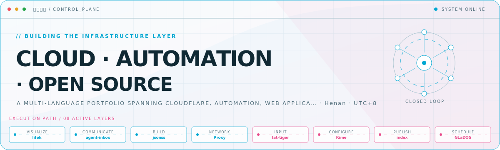
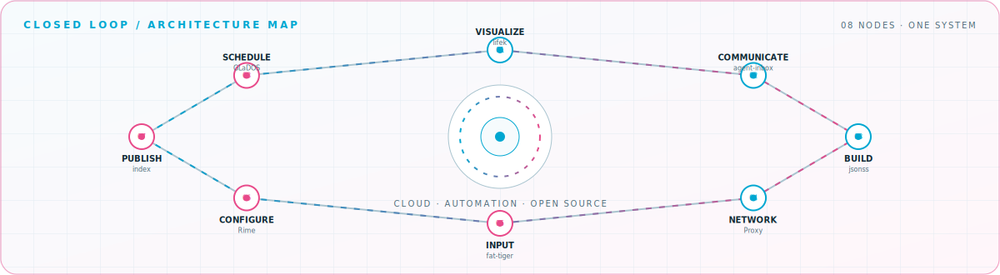

<picture>
  <source media="(prefers-color-scheme: dark)" srcset="assets/hero-dark.svg">
  <source media="(prefers-color-scheme: light)" srcset="assets/hero-light.svg">
  
</picture>

 

Projects and experiments across Cloudflare, workflow automation, developer tooling, and Chinese input methods\.

## Flagship systems

| Repository | Role | Purpose |
| --- | --- | --- |
| [`agent-inbox`](https://github.com/ovws/agent-inbox)  | CLOUDFLARE | Self-hosted email with Durable Objects, R2, Workers AI, and an integrated agent\. |
| [`fat-tiger`](https://github.com/ovws/fat-tiger)  | INPUT | A feature-rich Rime shape-based input method with language-model support\. |
| [`Proxy`](https://github.com/ovws/Proxy)  | NETWORK | 个人代理分流、规则与配置。 |
| [`Rime`](https://github.com/ovws/Rime)  | CONFIG | 个人 Rime 配置，包含虎码与魔然码。 |
| [`index`](https://github.com/ovws/index)  | START PAGE | A responsive personal navigation page with a lightweight interface\. |
| [`lishi-keyboard-theme`](https://github.com/ovws/lishi-keyboard-theme)  | KEYBOARD | 李氏三拼 3x5 键盘双字体主题。 |

## Closed-loop architecture

<picture>
  <source media="(prefers-color-scheme: dark)" srcset="assets/closed-loop-dark.svg">
  <source media="(prefers-color-scheme: light)" srcset="assets/closed-loop-light.svg">
  
</picture>

## Module registry

<strong>Cloud &amp; automation</strong> · 4 modules

| Module | Purpose |
| --- | --- |
| [`agent-inbox`](https://github.com/ovws/agent-inbox) | Self-hosted AI email on Cloudflare Workers\. |
| [`n8n`](https://github.com/ovws/n8n) | Workflow automation with code and no-code tools\. |
| [`GLaDOS`](https://github.com/ovws/GLaDOS) | Automated check-ins with GitHub Actions\. |
| [`dnsdev`](https://github.com/ovws/dnsdev) | DNS and cloud infrastructure experiments\. |

<strong>Input systems</strong> · 3 modules

| Module | Purpose |
| --- | --- |
| [`fat-tiger`](https://github.com/ovws/fat-tiger) | 基于 Rime 的虎码智能中文输入方案。 |
| [`Rime`](https://github.com/ovws/Rime) | 个人 Rime 配置，包含虎码与魔然码。 |
| [`lishi-keyboard-theme`](https://github.com/ovws/lishi-keyboard-theme) | 李氏三拼 3x5 键盘双字体主题。 |

<strong>Web &amp; applications</strong> · 4 modules

| Module | Purpose |
| --- | --- |
| [`jsonss`](https://github.com/ovws/jsonss) | A TypeScript application built with Google AI Studio\. |
| [`index`](https://github.com/ovws/index) | A responsive personal start page\. |
| [`resume`](https://github.com/ovws/resume) | A personal resume website built with HTML, CSS, and JavaScript\. |
| [`wikiq.github.io`](https://github.com/ovws/wikiq.github.io) | A personal website and publishing project\. |

<strong>Tools &amp; experiments</strong> · 4 modules

| Module | Purpose |
| --- | --- |
| [`Proxy`](https://github.com/ovws/Proxy) | 个人代理分流、规则与配置。 |
| [`bwg`](https://github.com/ovws/bwg) | A Go-based utility project\. |
| [`TwoGo`](https://github.com/ovws/TwoGo) | A Go experiment and utility project\. |
| [`comment`](https://github.com/ovws/comment) | NotionNuxt 评论插件。 |

<a href="https://github.com/ovws">GitHub</a> · <a href="https://t.me/woccn">Telegram</a> · <a href="https://twitter.com/wensqi">X / Twitter</a>

<!-- Generated by profile-control-plane. Edit profile.yaml, not this file. -->
