<picture>
  <source media="(prefers-color-scheme: dark)" srcset="assets/hero-dark.svg">
  <source media="(prefers-color-scheme: light)" srcset="assets/hero-light.svg">
  
</picture>

<picture>
  <source media="(prefers-color-scheme: dark)" srcset="assets/dashboard-dark.svg">
  <source media="(prefers-color-scheme: light)" srcset="assets/dashboard-light.svg">
  
</picture>

Live dashboard generated from public repositories where <code>fork = false</code>. Refreshed automatically by GitHub Actions.

## ◌ Signal routing

<picture>
  <source media="(prefers-color-scheme: dark)" srcset="assets/closed-loop-dark.svg">
  <source media="(prefers-color-scheme: light)" srcset="assets/closed-loop-light.svg">
  
</picture>

## ◉ Systems online

| Node | Mission | Runtime |
| --- | --- | --- |
| [`agent-inbox`](https://github.com/ovws/agent-inbox) | **EDGE AI** · Self-hosted AI email and agent tools | Cloudflare Workers · Durable Objects · R2 · Workers AI |
| [`lifek`](https://github.com/ovws/lifek) | **VISUALIZE** · AI-assisted life data visualization | TypeScript · React · Vercel |
| [`fat-tiger`](https://github.com/ovws/fat-tiger) | **INPUT ENGINE** · Intelligent Rime shape-based input | Lua · language model · multilingual modes |
| [`Rime`](https://github.com/ovws/Rime) | **CONFIG SYSTEM** · Tiger and Moran input environment | Rime schemas · Lua · OpenCC · dictionaries |
| [`Proxy`](https://github.com/ovws/Proxy) | **NETWORK RULES** · Personal traffic and DNS control | Routing · DNS · privacy · ad blocking |
| [`index`](https://github.com/ovws/index) | **PUBLISH** · Responsive personal start page | JavaScript · responsive UI · Vercel |

## ▣ Module registry

<strong>Edge, AI &amp; automation</strong> · 3 source repositories

| Module | Signal |
| --- | --- |
| [`agent-inbox`](https://github.com/ovws/agent-inbox) | Self-hosted AI email on Cloudflare Workers. |
| [`lifek`](https://github.com/ovws/lifek) | AI-assisted K-line visualization built with TypeScript. |
| [`GLaDOS`](https://github.com/ovws/GLaDOS) | Scheduled automation with GitHub Actions and Python. |

<strong>Input lab</strong> · 3 source repositories

| Module | Signal |
| --- | --- |
| [`fat-tiger`](https://github.com/ovws/fat-tiger) | 基于 Rime、语言模型与 Lua 扩展的虎码输入方案。 |
| [`Rime`](https://github.com/ovws/Rime) | 虎码、魔然码、词库、OpenCC 与个性化配置集合。 |
| [`lishi-keyboard-theme`](https://github.com/ovws/lishi-keyboard-theme) | 多字体、多设备版本的李氏三拼 3×5 键盘主题。 |

<strong>Web terminals</strong> · 4 source repositories

| Module | Signal |
| --- | --- |
| [`jsonss`](https://github.com/ovws/jsonss) | TypeScript application built with Google AI Studio. |
| [`index`](https://github.com/ovws/index) | Responsive personal navigation terminal. |
| [`resume`](https://github.com/ovws/resume) | Personal resume website using HTML, CSS, and JavaScript. |
| [`StudentManager`](https://github.com/ovws/StudentManager) | Management system using Spring, MyBatis, MySQL, and LayUI. |

<strong>Systems &amp; tools</strong> · 4 source repositories

| Module | Signal |
| --- | --- |
| [`Proxy`](https://github.com/ovws/Proxy) | 代理分流、DNS、隐私与安全规则配置。 |
| [`bwg`](https://github.com/ovws/bwg) | Go-based systems utility project. |
| [`bbs-go`](https://github.com/ovws/bbs-go) | Go application and backend experiment. |
| [`dockerfiles`](https://github.com/ovws/dockerfiles) | Container build definitions and deployment experiments. |

<a href="https://github.com/ovws">GitHub</a> · <a href="https://t.me/woccn">Telegram</a> · <a href="https://twitter.com/wensqi">X / Twitter</a>

<!-- Live dashboard data is generated by scripts/update_dashboard.py. -->
